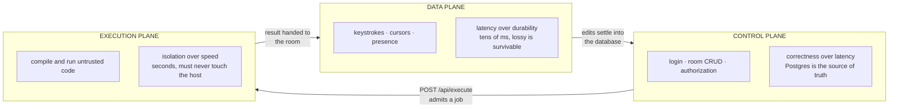
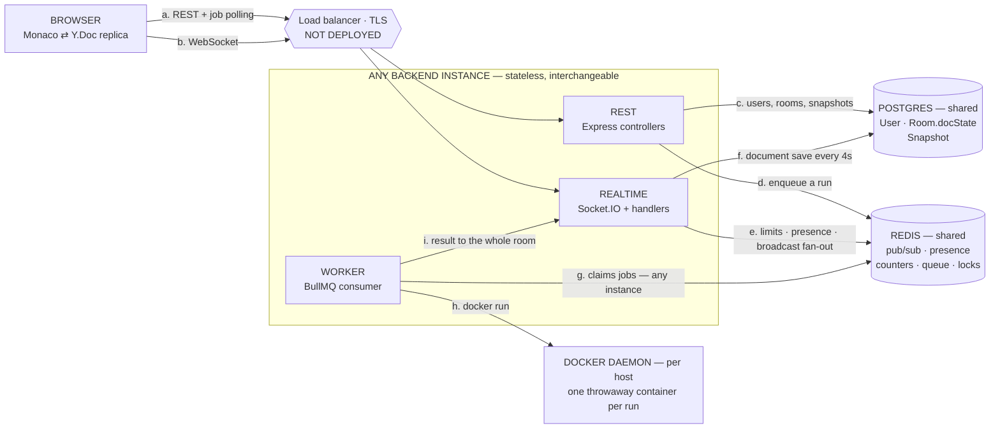
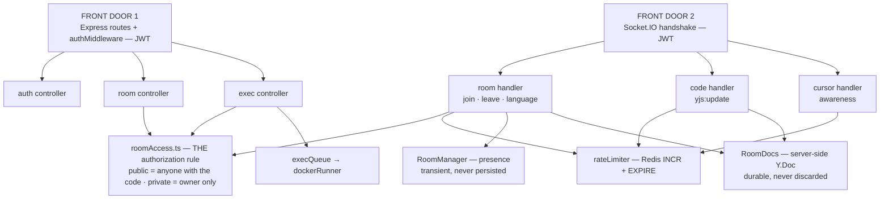
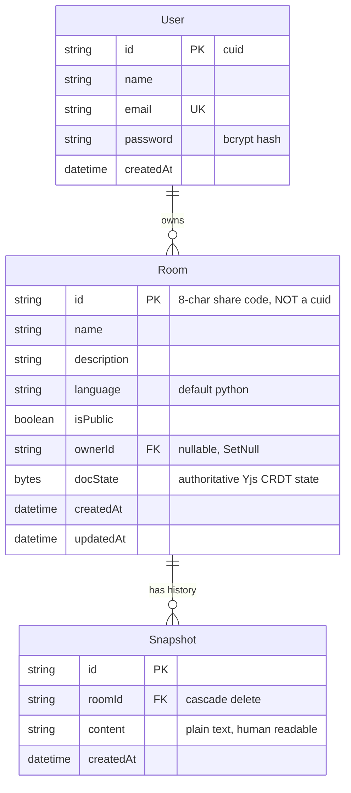
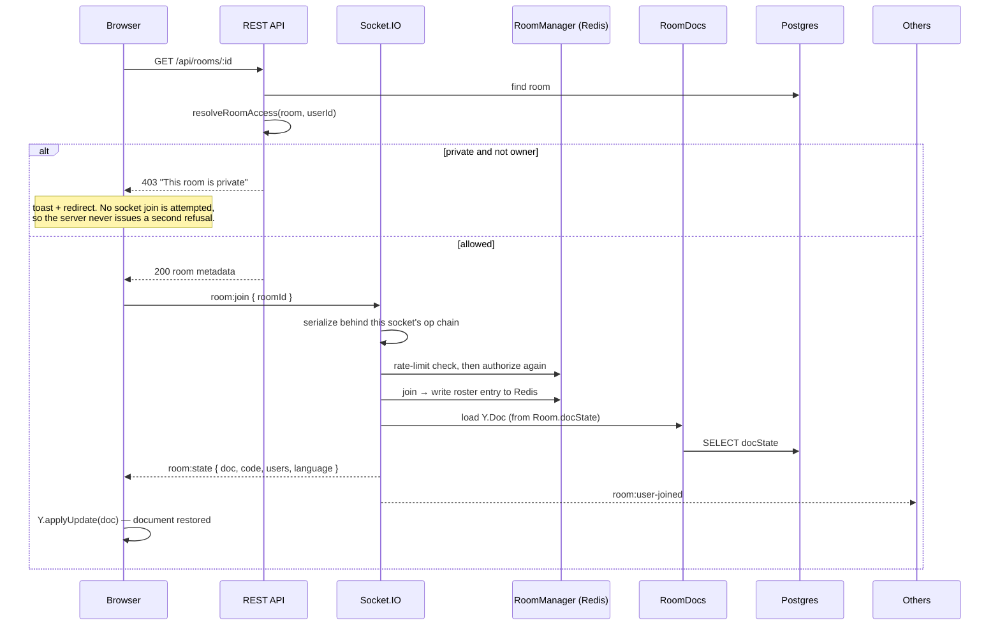
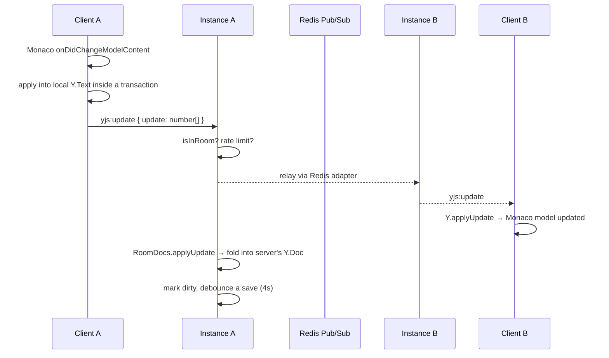
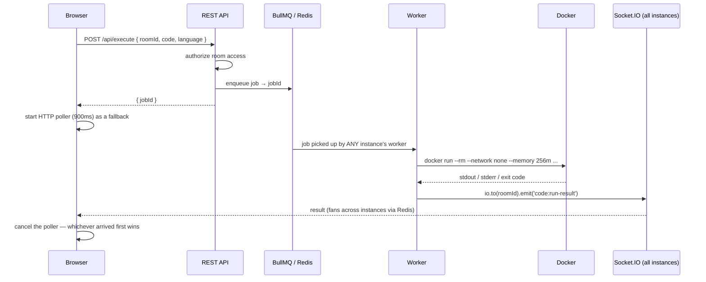
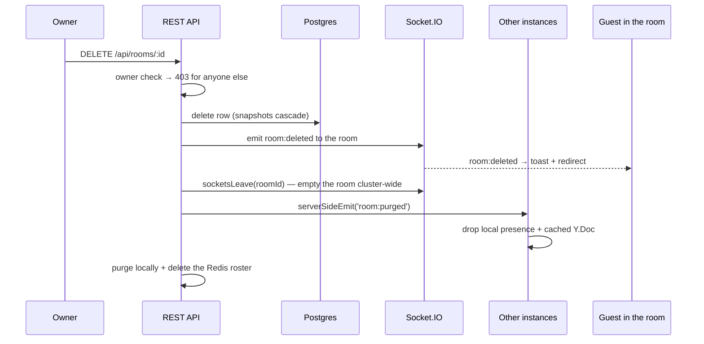
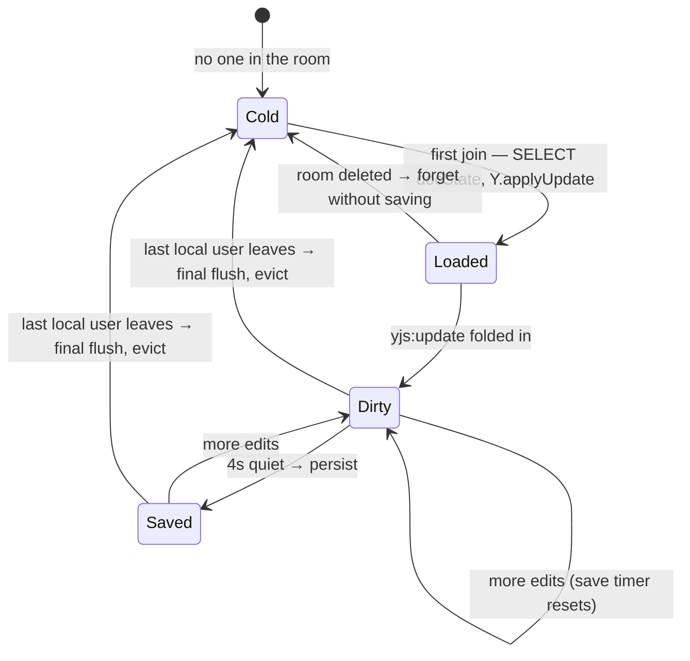
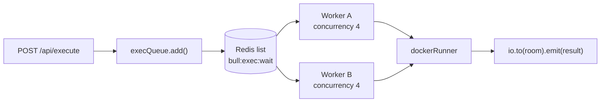

# CodeVerse — Architecture

A real-time collaborative code editor: many people edit one document simultaneously,
see each other's cursors, and run the result in a sandboxed container.

This document describes the system as it actually is today, and — where a concern is
only partly addressed or not addressed at all — how it is designed to be handled.
Every section is tagged so the two are never confused:

| Tag | Meaning |
|-----|---------|
| ✅ | Implemented and verified working |
| ⚠️ | Implemented with a real caveat or known limitation |
| ❌ | Present in the codebase but broken |
| 🔲 | Not implemented — design intent only |

---

## 1. The shape of the problem

Three hard problems sit underneath a product that looks simple:

1. **Concurrent editing.** Two people type into the same line at the same moment.
   There is no "correct" order of events — only an order everyone can agree on.
2. **Untrusted code execution.** Users submit arbitrary code and expect output.
   That code must not read the host, reach the network, exhaust the CPU, or outlive
   its welcome.
3. **Shared ephemeral state.** Presence, cursors and documents are per-room and
   change constantly, but the moment there is more than one server process, "in
   memory" stops meaning "shared".

Everything below follows from those three.

---

## 2. System topology

Four views, each answering one question: *why is it shaped this way* (2.1), *where does
traffic go* (2.2), *what is inside one instance* (2.3), and *where does state live* (2.4).

### 2.1 Why it is shaped this way — the three planes

Traffic in CodeVerse divides into three kinds with fundamentally different requirements.
Almost every architectural decision below follows from keeping them apart.



Work flows one way round that loop. You never block a keystroke on Postgres, and you never
run untrusted code on the thread serving WebSockets — ⚠️ except that today you do, because
the worker shares the API process (§2.5).

### 2.2 Where traffic goes



| Edge | Carries | Why it matters |
|------|---------|----------------|
| **a** | `POST /auth/*`, room CRUD, `POST /execute`, `GET /execute/:jobId` | Anything that must be durable or authorized before it happens. The job poll races **i** in case the socket dropped |
| **b** | `yjs:update`, `yjs:awareness`, `room:*` | The live channel. WebSocket transport only — no polling, which is why no sticky sessions are needed (§7.8) |
| **c** | SQL | The durable control-plane store |
| **d** | `execQueue.add()` | Decouples an HTTP request from a multi-second run |
| **e** | `INCR`/`EXPIRE`, roster hashes, adapter pub/sub | Three of Redis's five roles live on this edge (§7.4) |
| **f** | Read `docState` → merge → write union | Bidirectional on purpose: a save **reads first**, which is what makes concurrent saves safe (§7.3) |
| **g** | Job claim (a blocking pull) | **Any** instance's worker may take it, not the one that accepted the request |
| **h** | `docker run --rm --network none …` | Fresh container per execution; stdout/stderr streamed back |
| **i** | `io.to(roomId).emit('code:run-result')` | Fans out over **e**'s pub/sub, so it lands even when the runner is connected to a different instance |

**The two edges that make horizontal scaling work are e and f.** Without the pub/sub half
of **e**, half a room never sees an edit and a run result reaches only the instance that
executed it. Without the read-merge-write discipline on **f**, two instances overwrite each
other's saves. Everything else was already instance-agnostic.

### 2.3 Inside one instance

Two entry points, one authorization rule, and a clean split between transient and
persistent room state.



Three things this view is meant to make obvious:

1. **REST and WebSocket are independent front doors that converge on the same
   authorization rule.** The socket re-authorizes on `room:join` even though REST already
   did — it must never assume the client asked politely first.
2. **Every socket handler passes through the rate limiter**, and only the socket handlers
   do — ❌ which is exactly the gap: `POST /execute` reaches `execQueue` without a throttle,
   because the limiter sits on the socket path only (§7.7).
3. **`RoomManager` and `RoomDocs` are deliberately separate.** Presence is transient and
   never persisted; the document is durable and never thrown away. Conflating them is the
   most likely way to break this system.

### 2.4 Where state lives

The most useful question to ask here is "where does this piece of state live, and what
happens when the thing holding it dies?"

| State | Lives in | Lifetime | If its host dies |
|-------|----------|----------|------------------|
| Users, room metadata | Postgres | Permanent | Everything stops ⚠️ |
| Room document — authoritative | `Room.docState` (Postgres) | Permanent | — |
| Room document — working copy | `RoomDocs` in-process `Y.Doc` | While anyone is in the room | Edits since the last 4 s save are lost ⚠️ |
| Room document — replicas | Every browser's `Y.Doc` | While the tab is open | Nothing: peers and the server both hold it |
| Presence roster | Redis hash | While anyone is connected | Ghosts pruned within 30 s by heartbeat ✅ |
| socket → room mapping | Instance memory | Per connection | Irrelevant — those sockets died with it |
| Cursors / selections | Nowhere; in flight only | Milliseconds | Nothing to lose, by design |
| Rate-limit counters | Redis, TTL'd | 10–30 s | Limits reset; fails open ✅ |
| Queued jobs | Redis (BullMQ) | Until processed | Survive a restart; another worker claims them ✅ |
| Running container | Docker | ≤ 10 s | Killed with its worker |

The pattern: **anything that must survive goes to Postgres, anything shared between
instances goes to Redis, anything on the hot path stays in process memory.** The in-process
`Y.Doc` is the one deliberate exception — a cache of Postgres that absorbs keystroke-rate
writes, which is precisely why it needs the 4-second debounce and the final flush.

### 2.5 Processes and ports

| Process | Port | Command | Notes |
|---------|------|---------|-------|
| Backend API + WebSocket + worker | 4000 | `npm run dev` (backend) | One process does all three roles ⚠️ |
| Vite dev server | 5173 | `npm run dev` (web) | Proxies `/api` and `/socket.io` to 4000 |
| PostgreSQL | 5432 | `docker compose up -d` | |
| Redis | 6379 | `docker compose up -d` | |
| Docker daemon | — | Docker Desktop | Must be running or every code run fails |

**The load balancer is the only box in §2.2 that does not exist yet.** Everything behind it
is already instance-agnostic and has been verified running as two processes sharing one
Redis and one Postgres.

⚠️ **The API server and the execution worker are the same process.** `startExecWorker(io)`
is called from `server.ts`, so every API instance also pulls jobs off the queue — which is
why the execution plane in §2.1 is not really isolated from the data plane today. A burst
of executions competes for the same event loop that is serving WebSocket traffic. Splitting
the worker into its own deployable is a configuration change (a `WORKER_ONLY` / `API_ONLY`
flag), not a redesign, because the queue is already the only coupling between them.

## 3. Component map

### Backend (`backend/src`)

```
server.ts                  entrypoint: env validation, Express, HTTP+Socket.IO, worker, shutdown
app.ts                     ❌ DEAD — a second unused Express app, imported by nothing

config/
  db.ts                    PrismaClient singleton (⚠️ logs every query)
  redis.ts                 ioredis factory + shared singleton

middleware/
  auth.middleware.ts       JWT bearer guard → req.userId

routes/                    thin routers: auth, room, exec
  user.routes.ts           ❌ DEAD — plaintext passwords, unauthenticated user list

controllers/
  auth.controller.ts       register / login / me — bcrypt(10), JWT 7d
  room.controller.ts       room CRUD + snapshots listing
  exec.contoller.ts        enqueue a run, poll a job  (sic: filename typo)

services/
  roomAccess.ts            THE authorization rule — used by REST and sockets alike

realtime/
  socket.ts                Socket.IO server, JWT handshake auth, Redis adapter, purge listener
  roomManager.ts           presence: Redis roster + local socket→room map + instance heartbeat
  roomDocs.ts              server-side Y.Doc per room, debounced persistence, save locks
  roomPurge.ts             cluster-wide teardown of a deleted room
  ioRegistry.ts            lets REST controllers reach io without an import cycle
  rateLimiter.ts           Redis INCR+EXPIRE counters

handlers/                  per-socket event handlers
  room.handlers.ts         join / leave / language-change, departure grace period, op serialization
  code.handlers.ts         yjs:update relay + fold into server doc
  cursor.handlers.ts       awareness / cursor relay

queues/
  execQueue.ts             BullMQ queue + worker factory
  dockerRunner.ts          the sandbox: builds the docker argv, spawns, caps, kills
```

### Frontend (`web/src`)

```
App.tsx                    routes + auth guards
contexts/
  AuthContext.tsx          token in localStorage, /me re-validation, socket teardown on identity change
  ToastContext.tsx         portal toasts
lib/
  api.ts                   fetch wrapper, bearer token, typed endpoints
  socket.ts                lazy Socket.IO singleton + event-name constants
  useYjsEditor.ts          THE hard one — hand-rolled Yjs ⇄ Monaco binding, remote cursors
  useJobPoller.ts          HTTP polling fallback racing the socket result
  monacoTheme.ts           "midnight" theme matching the CSS tokens
pages/
  LandingPage · AuthPage · DashboardPage · EditorPage
types/index.ts             shared types + per-language starter templates
index.css                  ~1k lines, CSS custom properties, no Tailwind despite the dependency ⚠️
```

---

## 4. Data model



Two deliberate choices:

- **The room id is the share code.** `createRoom` generates an 8-character uppercase
  alphanumeric string and uses it as the primary key, retrying up to 10 times on
  collision. This is why "join by code" needs no lookup table — the code *is* the id.
  It also means the id space is guessable: 36⁸ ≈ 2.8×10¹², which is fine against
  casual guessing but is not a security boundary. Authorization does that job.
- **`docState` is bytes, `Snapshot.content` is text.** They are not redundant. See §7.3.

---

## 5. Key flows

### 5.1 Opening a room ✅



The join handler authorizes **again** even though REST already did. The socket is a
separate entry point and must never rely on the client having asked politely first.

### 5.2 Collaborative editing ✅ ⚠️



⚠️ **The client sends the entire document state on every keystroke.**
`useYjsEditor` calls `Y.encodeStateAsUpdate(ydoc)` — a full state vector — rather than
the incremental diff Yjs hands you from the `update` event, and serialises it as a JSON
array of numbers (roughly 3–4× the byte cost of the binary form). For a 200-line file
that is a few KB per keypress. It is correct — Yjs merges are idempotent, so re-sending
known state is harmless — but it is O(document) per keystroke where it should be
O(change). The fix is to subscribe to `ydoc.on('update', ...)` and relay that buffer,
which is also what makes the server-side doc cheaper to maintain.

### 5.3 Code execution ✅



Two delivery paths race deliberately: the socket push (fast, but needs a live
connection) and HTTP polling (slow, but survives a dropped socket). The first to
arrive calls `cancelPolling()`.

### 5.4 Persistence ✅

See §7.3 — this is the most subtle flow in the system and gets its own section.

### 5.5 Room deletion ✅



Deletion is cleanup *after* the row is gone, not a transaction. A partial failure here
leaves stale memory that heartbeats and TTLs will reap — never a half-deleted room.

---

## 6. Deep dive: conflict handling

### 6.1 Why not last-write-wins ✅

The naive approach — broadcast the whole buffer on every change, last writer wins —
loses data whenever two people type at once, and the loss is silent. Operational
Transformation (OT) fixes that but requires a central server that transforms every
operation against every concurrent one; the transformation functions are notoriously
difficult to get right.

CodeVerse uses a **CRDT** (Conflict-free Replicated Data Type) via Yjs. The guarantee:
any two replicas that have seen the same set of operations converge to the same state,
regardless of the order they arrived in, with no central arbiter and no transformation
logic.

### 6.2 How Yjs actually resolves a conflict

Yjs models text as a doubly-linked list of items. Every insert carries a unique
`(clientID, clock)` identity and points at the item it was inserted after. When two
clients insert at the same position concurrently, both items claim the same origin, and
Yjs orders them deterministically by comparing client IDs. Every replica performs the
same comparison and reaches the same answer.

Deletions are tombstones — the item stays in the structure marked deleted — which is
what makes a delete concurrent with an insert-inside-the-deleted-range resolvable
rather than ambiguous.

Consequences that matter here:

- **Order of arrival is irrelevant.** This is why the server can relay updates without
  sequencing them, and why a client that reconnects and replays old updates causes no harm.
- **Applying the same update twice is a no-op.** Idempotence is why the wasteful
  full-state broadcast in §5.2 is merely wasteful and not incorrect.
- **The document grows monotonically.** ⚠️ Tombstones are never collected, so
  `docState` grows with edit history, not with document length. A long-lived room
  accumulates bytes forever. Yjs's answer is `Y.encodeStateAsUpdate` with garbage
  collection enabled plus periodic re-encoding; a simpler mitigation is to rebuild the
  document from text during a window when the room is empty, which is safe precisely
  because no peer holds a conflicting history at that moment. 🔲 Neither is implemented.

### 6.3 The one thing a CRDT does not solve

CRDTs guarantee *convergence*, not *intent preservation*. If two people rewrite the same
function simultaneously, everyone ends up with the same text — but that text may be an
interleaving neither person wanted. This is inherent, not a bug. Editors mitigate it
socially (visible cursors, selections, presence) rather than technically, which is
exactly what the awareness channel is for.

### 6.4 Seeding is the dangerous operation ✅

The subtlety that governs the persistence design: **rebuilding a document by inserting a
plain string creates brand-new CRDT operations.** If instance A and instance B both
"restore" a room by inserting the same text into fresh documents, those are two distinct
sets of insert operations with different identities. Merge them and you get the text
twice.

This is why the system persists and restores the **binary CRDT state**, never text. Every
replica applies the identical bytes, reproduces the identical operation history, and
merges are idempotent. It is also why the editor no longer pre-seeds starter code before
`room:state` arrives — that pre-seed would merge with the restored document and duplicate it.

---

## 7. Deep dives, subsystem by subsystem

### 7.1 The awareness channel ⚠️

Cursors, selections and "who is here" are *ephemeral* state: they should never be
persisted, never be merged, and should vanish when a client disconnects. Yjs ships an
`awareness` protocol for exactly this — a CRDT-adjacent map of `clientID → state` with
timeouts and automatic cleanup.

**CodeVerse does not use it.** It implements a hand-rolled equivalent:

```
client  --yjs:awareness { roomId, state }-->  server
server  overwrites state.userId/username with the AUTHENTICATED values
server  --yjs:awareness-->  every other client in the room
client  renders Monaco deltaDecorations, one per remote user
```

What works: per-user deterministic colours, labelled carets, selection highlights,
CSS injected once per user id, decorations cleared on `room:user-left`.

The caveats:

- ⚠️ **Positions are absolute line/column, not relative positions.** Yjs offers
  `createRelativePosition`, which anchors to a CRDT item so the cursor moves correctly
  when text above it changes. Here, a remote cursor only moves when its owner sends a
  new awareness event — so during someone else's edit, remote carets drift until the
  next mouse or key event.
- ⚠️ **No timeout-based cleanup.** A client that vanishes without a clean disconnect
  leaves its decoration until `room:user-left` fires. The 3s departure grace period
  (§7.7) means that is not instant.
- ✅ **Identity is server-authoritative.** The server overwrites `userId`/`username` on
  every relayed awareness packet, so a client cannot impersonate another user's cursor.
- 🔲 No "following" / viewport sync, no idle detection.

Rate limited at 300 events / 10s per user, and dropped silently rather than erroring —
a throttled cursor is invisible, a throttled error toast is noise.

### 7.2 Presence ✅

Presence answers "who is in room X" across all instances.

```
Redis  presence:room:{roomId}      HASH  socketId → { userId, username, color, joinedAt, instanceId }
Redis  presence:instance:{id}      STRING with 30s TTL, refreshed every 10s
local  socketRoom                  Map socketId → roomId   (this process only)
local  localRooms                  Map roomId → Map<socketId, RoomUser>
```

The split is the point:

- The **roster** must be shared — the REST API's `activeUsers` count and the
  `room:state` user list have to reflect every instance.
- The **socket→room lookup** must not be. It runs on every keystroke (`isInRoom` guards
  every `yjs:update`), and a socket only ever exists on the process it connected to. Keeping
  it in local memory removes a Redis round-trip from the hottest path in the system.

**Crash safety.** A process killed with SIGKILL leaves roster entries behind. Each entry
carries the `instanceId` that wrote it, and each instance keeps a heartbeat key alive
with a 30s TTL. On read, entries whose instance has no heartbeat are pruned and deleted.
Verified: a hard-killed instance's ghost user disappeared ~24s later. A graceful shutdown
skips the wait and removes its own entries immediately. As a final backstop, room hashes
carry a 1-hour TTL refreshed by the heartbeat, so a roster nobody ever reads again cannot
leak forever.

### 7.3 Document persistence ✅

The requirement: a room's code survives everyone leaving, a server restart, and being
edited from two instances at once.

**Storage.** `Room.docState` holds `Y.encodeStateAsUpdate(ydoc)` — bytes, for the reason
in §6.4. `Snapshot.content` holds plain text for the human-readable history endpoint.
They serve different purposes and neither replaces the other.

**Lifecycle.**



**The concurrency problem.** Instances do not gossip document updates to each other.
Instance A's server-side doc only sees edits from clients connected to A. So A's view can
legitimately be behind B's. If A simply wrote its own state, B's edits would be lost.

**The solution — read-merge-write under a lock:**

```
1. acquire  SET docsave:{roomId} {instanceId} NX EX 10
2. read     SELECT docState FROM Room
3. merge    Y.applyUpdate(myDoc, storedState)      ← union, not overwrite
4. write    UPDATE Room SET docState = encode(myDoc)
5. release  DEL docsave:{roomId}
```

Because step 3 folds the stored state into the local document before step 4 writes it
back, **a save can never shrink the stored document**. Whichever instance wins the race,
the last writer produces a superset. Order becomes irrelevant — the same property the
CRDT gives us within a document, applied to the database.

**Lock contention is handled differently for the two kinds of save.** A debounced save
that loses the lock simply reschedules — there will be a later chance. A *final* flush
(last user left, or shutdown) has no later, so it retries for up to 5 seconds; if it still
fails, the document is kept in memory rather than discarded. This distinction was a real
bug found in testing: giving up on the final flush silently lost an instance's edits.

**Timing.** 4s debounce after the last edit · final flush on room empty · full flush on
shutdown · history snapshots at most once per minute per room, plus one on room close.

### 7.4 Redis, in five distinct roles ✅

One server, five unrelated jobs. Worth separating, because they have different failure
behaviours and different scaling limits.

| Role | Keys | If Redis dies |
|------|------|---------------|
| Socket.IO adapter pub/sub | `socket.io#…` | Cross-instance broadcast stops; single-instance still works |
| Presence rosters | `presence:room:*`, `presence:instance:*` | Falls back to a local-only view of the room |
| Rate limiting | `rl:{event}:{userId}` | **Fails open** — all requests allowed |
| Job queue (BullMQ) | `bull:exec:*` | Execution stops entirely |
| Document save locks | `docsave:{roomId}` | Treated as uncontended — single-instance semantics |

The fail-open choice for rate limiting is deliberate: a Redis blip should degrade abuse
protection, not take down editing. The fail-soft choices for presence and locks mean a
Redis outage degrades a multi-instance deployment to something like several independent
single-instance deployments, rather than to an outage.

🔲 **No caching layer.** Redis is used as coordination substrate, never as a read cache.
Room metadata and user lookups hit Postgres every time — including `attachUserData`, which
does a `SELECT` on every socket connection. Caching user id → username with a short TTL is
the obvious first win if connection rate ever matters.

### 7.5 The job queue ✅



Why a queue at all, when execution could be synchronous? Three reasons: a run takes
seconds and would hold an HTTP connection open; unbounded concurrent `docker run` calls
will exhaust the host; and retries need somewhere to live.

Configuration: 2 attempts, fixed 2s backoff, last 200 completed / 100 failed jobs retained
for inspection, worker concurrency 4 per instance. Job ids are
`exec-{roomId}-{Date.now()}`.

⚠️ **Results are broadcast to the entire room, not to the requester.** That is intentional
— collaborators watch each other's output — but it does mean any room member can trigger
output that everyone sees.

⚠️ **The worker is co-hosted with the API** (see §2).

🔲 **No autoscaling**, despite the README's "auto-scaled workers". Concurrency is a fixed
constant. Real autoscaling would read queue depth (`execQueue.getWaitingCount()`) and
drive a container orchestrator.

### 7.6 The Docker sandbox ✅

Every run gets a fresh container. The full argv:

```
docker run --rm                      delete the container on exit
  --network none                     no DNS, no internet, no host network
  --memory 256m --memory-swap 256m   hard RAM ceiling, swap disabled
  --cpus 0.5                         half a core
  --pids-limit 64                    fork-bomb protection
  --read-only                        immutable container filesystem
  --tmpfs /tmp:rw,size=32m,exec      the only writable surface
  -v {hostTmpDir}:/code:ro           user code, mounted read-only
  -w /code
  {image} {cmd}
```

Plus, outside Docker: a 10s `setTimeout` that `SIGKILL`s the process (exit code 124),
stdout capped at 8 KB, stderr at 4 KB, stdin closed so code cannot block on input, and the
host temp directory removed in every exit path.

| Language | Image | Command | Status |
|----------|-------|---------|--------|
| JavaScript | `node:20-alpine` | `node main.js` | ✅ |
| Python | `python:3.12-alpine` | `python main.py` | ✅ |
| C++ | `gcc:13` | `g++ -o /tmp/main main.cpp && /tmp/main` | ✅ |
| Java | `eclipse-temurin:21-alpine` | `cp → /tmp`, `javac`, `java Main` | ✅ |
| TypeScript | `node:20-alpine` | `npx --yes ts-node --transpile-only main.ts` | ❌ **broken** |

❌ **TypeScript cannot work as written.** `npx --yes ts-node` tries to download ts-node
from the npm registry, but `--network none` blocks DNS. Verified failure:
`npm error code EAI_AGAIN … getaddrinfo registry.npmjs.org`, exit 1. Any user who picks
TypeScript and hits Run gets an npm error instead of output. The fix is a purpose-built
image with TypeScript preinstalled, or transpiling client-side and executing the emitted
JavaScript with `node`.

⚠️ **First run of an uncached image will time out.** `docker run` pulls a missing image
before starting the container, but the 10s kill timer starts at spawn. `gcc:13` is ~2 GB.
On a fresh host the first C++ run dies mid-pull with a confusing timeout. Images must be
pre-pulled during deployment.

**What this sandbox does not defend against** 🔲: container escape via a kernel exploit
(there is no gVisor/Kata/microVM layer, and no seccomp or AppArmor profile beyond Docker's
defaults); the container runs as root inside its namespace (`--user nobody` is not set);
and disk I/O is unthrottled apart from the 32 MB tmpfs. For a public deployment, running
the daemon rootless and adding a hardened runtime would be the next steps.

### 7.7 Rate limiting ⚠️

A fixed-window counter in Redis:

```
INCR rl:{event}:{userId}
if count == 1: EXPIRE key {windowSecs}
allow if count <= max
```

| Event | Limit | Applied? |
|-------|-------|----------|
| `yjs:update` | 200 / 10s | ✅ |
| `code:change` | 120 / 10s | ✅ (on a path nothing uses) |
| `cursor:move` / awareness | 300 / 10s | ✅ |
| `room:join` | 10 / 30s | ✅ |
| **code execution** | 5 / 30s | ❌ **defined but never called** |

❌ The `RUN_CODE` preset exists in `rateLimiter.ts` and is documented in the README, but
no code path invokes it. `POST /api/execute` has **no per-user throttle at all** — the
most expensive operation in the system is the only unthrottled one. One line in
`exec.contoller.ts` closes this.

⚠️ **Fixed windows allow double-rate bursts at boundaries.** 200 requests at 9.9s plus 200
at 10.1s is 400 in 200ms, all "within limits". A sliding-window log or token bucket
(`INCRBYFLOAT` with a timestamp, or a small Lua script) removes this. For per-keystroke
events it barely matters; for execution it would.

⚠️ **Limits are per user, not per room or per IP.** Registration and login are unthrottled,
so account creation itself is not rate limited. 🔲

### 7.8 Horizontal scaling and load balancing ⚠️ 🔲

**What is done ✅.** The backend is stateless with respect to which instance a client
lands on:

- `@socket.io/redis-adapter` fans every `io.to(room)` broadcast across instances via
  Redis pub/sub, so edits, cursors, language changes and run results reach the whole
  room regardless of topology. It also means a job executed by instance A's worker
  reaches a user connected to instance B — which did not work before the adapter.
- Presence lives in Redis (§7.2), so `activeUsers` aggregates every instance.
- Document saves are safe under concurrency (§7.3).
- Room deletion propagates cluster-wide via `serverSideEmit`.

Verified by running two instances against one Redis and one Postgres: cross-instance
joins, edits, cursors, language changes, run results, aggregated counts, and crash
recovery all behave.

**Sticky sessions.** The client sets `transports: ['websocket']`, so a connection is a
single HTTP upgrade to one server and stays there. That sidesteps the usual Socket.IO
requirement for sticky sessions — which exists because HTTP long-polling spreads one
logical session across several requests that must all reach the same process. ⚠️ **If
polling is ever re-enabled as a fallback, sticky sessions (`ip_hash`, or cookie-based
affinity) become mandatory.** This is the single easiest way to break a working
deployment.

**Not done** 🔲:

- No load balancer, no reverse proxy, no TLS termination.
- No health/readiness endpoints beyond `GET /api/health` (no dependency checks — it
  returns ok even if Postgres is down).
- No container image for the backend, no orchestration manifests.
- No graceful connection draining: shutdown closes sockets and clients reconnect, which
  the departure grace period (§7.9) masks but does not solve.
- Postgres is a single instance with no read replicas or pooler (PgBouncer). ⚠️ Note the
  double `PrismaClient` (`config/db.ts` and `room.controller.ts` each construct one), so
  the pool count is already double what it should be.

### 7.9 Presence notifications and the grace period ✅

A refresh, a brief network drop and React's development double-mount are indistinguishable
from the server's side: a socket disappears and an equivalent one appears moments later.
Announcing departures immediately made every room flash "X left / X joined" for people who
never left.

Three mechanisms, layered:

1. **Client idempotence.** `room:join` is emitted at most once per (connection, room); the
   effect cleanup defers `room:leave` by a tick so a re-mount cancels it.
2. **Server serialization.** Join and leave for one socket run on a promise chain, so a
   fast leave can no longer overtake a slow join and invert the broadcast order.
3. **Departure grace period.** `room:user-left` is held for 3 seconds and dropped entirely
   if the person returns — re-checked against the shared roster at fire time, so a
   reconnect on a *different* instance also cancels it.

`room:user-joined` still fires once per arriving connection, because peers use it to push
their document state to a newcomer. The client suppresses the toast for anyone already in
its roster, so a second tab updates the list without announcing a new arrival.

### 7.10 Authorization ✅

One rule, one file, two enforcement points:

```
public room   → any authenticated user with the code
private room  → the owner only
```

`services/roomAccess.ts` is called by `GET /api/rooms/:id`, `GET /api/rooms/:id/snapshots`,
`POST /api/execute` and the socket `room:join` handler. `PATCH` and `DELETE` are owner-only.
A refused join returns 403 over REST or an `error` event over the socket, and never a room
payload.

A private room is deliberately a 403 rather than a 404 cloak: the caller already proved they
know the id, since the id *is* the share code.

🔲 **There is no membership model.** "Private" means "owner only", matching the wording in
the create-room dialog. Collaborating on a private room is therefore impossible — the
feature people will ask for next is a `RoomMember` table with invitations, which would also
fix the dashboard listing only rooms you own.

⚠️ Tokens are 7-day JWTs in `localStorage` with no refresh, no rotation, and no
revocation list. Logout is client-side only; a stolen token stays valid until it expires.

### 7.11 Failure modes

| Failure | Behaviour today |
|---------|-----------------|
| Docker not running | Every run returns "Failed to start Docker: … Make sure Docker is running" ✅ |
| Redis down | Rate limits fail open; presence falls back to local; queue and execution stop ⚠️ |
| Postgres down | Auth and room endpoints 500; live editing continues; saves retry and fail ⚠️ |
| Instance SIGKILLed | Ghost presence reaped in ≤30s; unsaved edits since the last 4s debounce are lost ⚠️ |
| Client disconnects | Reconnects automatically (10 attempts); departure suppressed for 3s ✅ |
| Deleted room, users inside | `room:deleted` → toast → redirect; cluster-wide purge ✅ |
| Two instances saving at once | Read-merge-write under a Redis lock; no data loss ✅ |
| Runaway user code | 10s SIGKILL, 256 MB cap, 64 pids, 0.5 CPU, no network ✅ |

---

## 8. Tuning constants

Everything worth knowing, in one place. All are compile-time constants; 🔲 none are
configurable via environment variables.

| Constant | Value | Where |
|----------|-------|-------|
| Execution timeout | 10 s | `dockerRunner.ts` |
| Execution memory / CPU / pids | 256 MB / 0.5 / 64 | `dockerRunner.ts` |
| stdout / stderr caps | 8 KB / 4 KB | `dockerRunner.ts` |
| Worker concurrency | 4 per instance | `execQueue.ts` |
| Job retries / backoff | 2 attempts / 2 s fixed | `execQueue.ts` |
| Document save debounce | 4 s | `roomDocs.ts` |
| Snapshot minimum interval | 60 s | `roomDocs.ts` |
| Save lock TTL / final retry | 10 s / 25 × 200 ms | `roomDocs.ts` |
| Presence heartbeat TTL / interval | 30 s / 10 s | `roomManager.ts` |
| Room roster key TTL | 1 h | `roomManager.ts` |
| Departure grace period | 3 s | `room.handlers.ts` |
| Socket ping timeout / interval | 20 s / 10 s | `socket.ts` |
| Max socket message | 5 MB | `socket.ts` |
| JWT lifetime | 7 days | `auth.controller.ts` |
| bcrypt cost | 10 | `auth.controller.ts` |
| HTTP job poll interval / cap | 900 ms / ~60 s | `useJobPoller.ts` |

---

## 9. Roadmap — what a serious deployment still needs

Ordered by how much they would hurt in production.

1. **Fix TypeScript execution** ❌ — currently returns an npm error to every user who picks it.
2. **Apply the execution rate limit** ❌ — one line; the queue is otherwise open to abuse.
3. **Send incremental Yjs updates as binary** ⚠️ — the single biggest bandwidth win.
4. **Split the worker from the API** ⚠️ — so execution load cannot starve WebSocket traffic.
5. **Delete `app.ts` and `user.routes.ts`** ❌ — unmounted, but they store plaintext
   passwords and expose an unauthenticated user list if ever wired up.
6. **Load balancer + TLS + real health checks** 🔲 — with polling kept disabled, or sticky
   sessions if not.
7. **Membership model** 🔲 — private rooms are currently single-player.
8. **Document compaction** 🔲 — `docState` grows with edit history forever.
9. **Sandbox hardening** 🔲 — rootless daemon, non-root user, seccomp profile.
10. **Observability** 🔲 — no metrics, no tracing, no structured logs; `console.log`
    throughout, and Prisma logs every query unconditionally.
11. **Tests** 🔲 — no automated test suite exists in either package.
